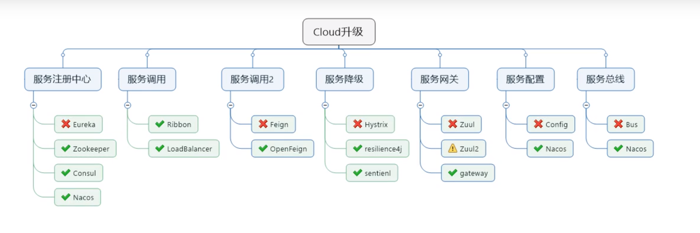

# SpringCloud

## 1.技术栈总览 




## 2.备忘录

### 2.1 Consul 下载

consul 下载路径

https://releases.hashicorp.com/consul/


consul 启动命令

```she
consul agent -dev
```

### 2.2 Consul配置中遇到的问题

1)健康检测的url，如果不配置，健康检测一定失败

可以通过下面的链接查看Consul的检查情况

```html
http://localhost:8500/v1/agent/checks
```

spring.cloud.consul.discovery.health-check-path记得要写全路径，否则会出错。

```yaml
server:
  port: 8006
  servlet:
    context-path: /payment-service

spring:
  application:
    name: cloud-payment-provider
  cloud:
    consul:
      host: localhost
      port: 8500
      discovery:
        service-name: ${spring.application.name}
        prefer-ip-address: true
        health-check-url: http://${spring.cloud.client.ip-address}:${server.port}${server.servlet.context-path}/actuator/health
```

